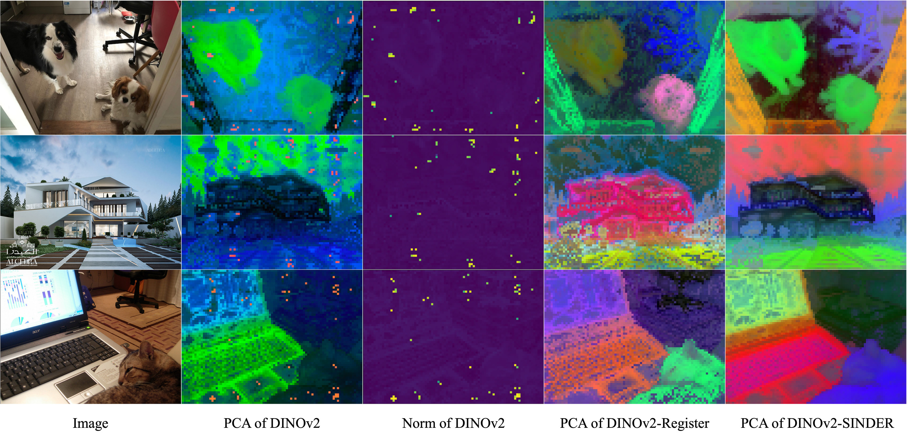

# Official code for SINDER: Repairing the Singular Defects of DINOv2 (ECCV 2024)

[](https://arxiv.org/abs/2407.16826)



## Citation

```bibtex
@InProceedings{Haoqi_2024_ECCV,
author = {Wang, Haoqi and Zhang, Tong and Salzmann, Mathieu},
title = {{SINDER}: Repairing the Singular Defects of DINOv2},
booktitle = {Proceedings of the European Conference on Computer Vision (ECCV)},
month = {September},
year = {2024}
}
```

## Install

```bash
conda env create -f environment.yml
conda activate sinder
```

## Train

Put ImageNet-1K dataset at `data/imagenet` folder.

```bash
./main.py
```

## Checkpoints
